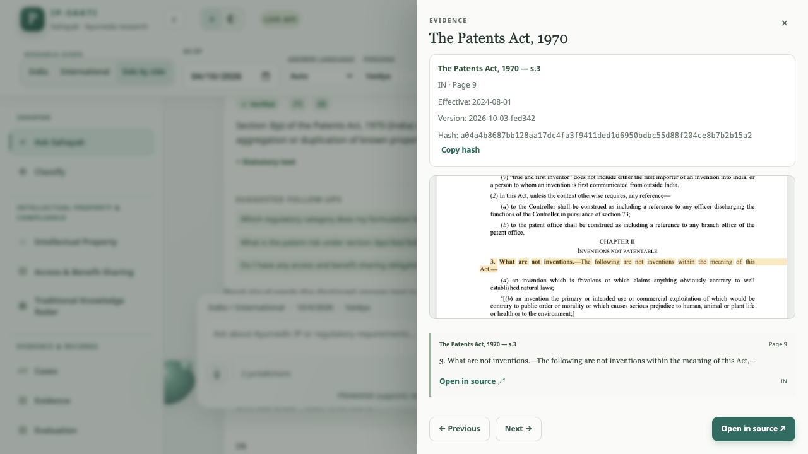
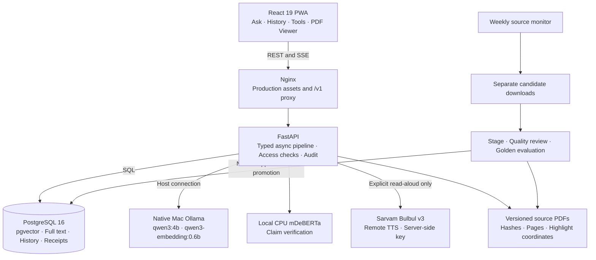
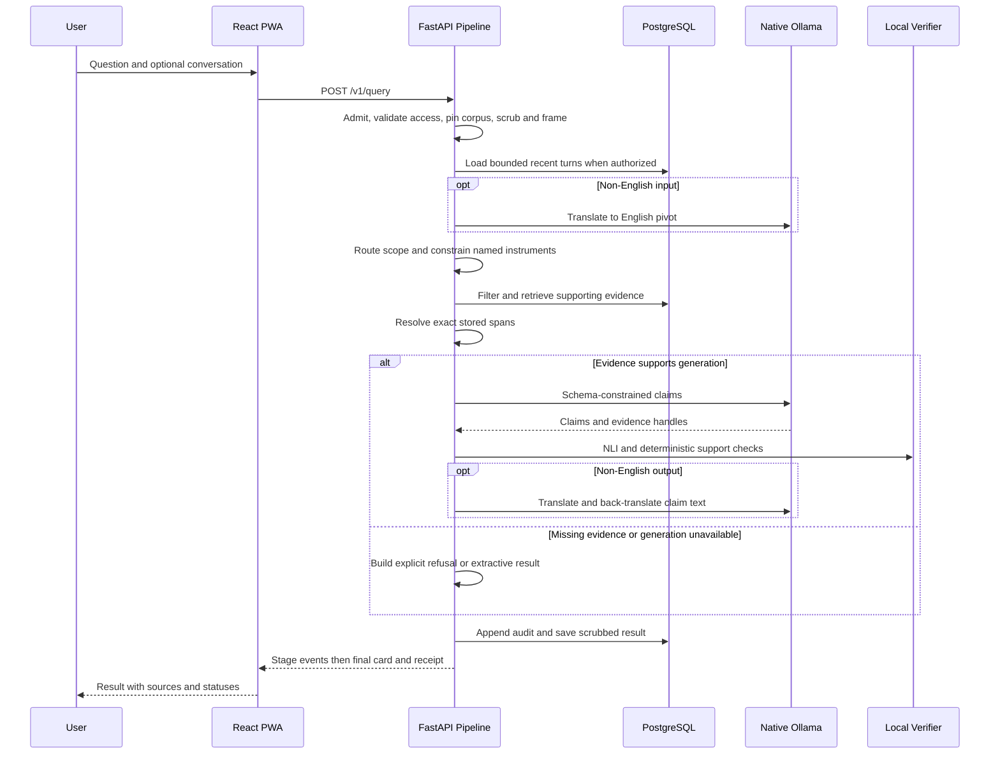

<div align="center">

# 📜 PRAMANA

### **IP-SAKTI Sahayak**

*Citation-Grounded, Multilingual Ayurveda IP and Regulatory Research with Local Inference*

[](PRAMANA_IMPLEMENTATION_PLAN.md)
[](PRAMANA_IMPLEMENTATION_PLAN.md)
[](backend/pyproject.toml)
[](frontend/package.json)
[](docker-compose.yml)
[](backend/app/generation/llm.py)
[](docker-compose.yml)

---

PRAMANA is a local web app for researching Ayurvedic intellectual property, product classification, biodiversity and regulatory requirements. It retrieves official legal sources from a versioned corpus, generates structured claims using native Ollama, and checks those claims against their supporting evidence before displaying them. Citations open the pinned source PDF; receipts record the answer's provenance.

**Question in** (text, with optional Sarvam read-aloud for answers) →<br />
**Evidence-grounded result out** (verified or partial claims, source extracts, or an explicit refusal).

`🔗 Server-Resolved Citations` · `🏠 Local Ollama` · `💬 Shared Saved History` · `🧾 Verifiable Receipts`

</div>

> [!IMPORTANT]
> A real supported question has produced verified synthesis end to end. The complete implementation plan is **not yet finished**: the staged Qwen corpus fails extraction-quality review and has not been approved or promoted. The current live corpus uses keyword retrieval. See the dated [verification report](docs/VERIFICATION_REPORT.md) and [canonical implementation plan](PRAMANA_IMPLEMENTATION_PLAN.md).

---

<a id="features-offered"></a>
## ✨ Features Offered

| # | Feature | Description |
|---|---------|-------------|
| 1 | **Citation-grounded answers** | Native `qwen3:4b` emits schema-constrained claims with evidence handles. The server resolves source text and verifies support. |
| 2 | **Version, date and jurisdiction filtering** | Retrieval uses the pinned corpus version, selected India/international regime and indexed effective dates. Historical accuracy depends on source and amendment coverage. |
| 3 | **Explicit abstention** | Out-of-domain, in-scope/no-evidence, low-confidence and generation-unavailable results remain distinct. |
| 4 | **Section-aware retrieval** | Exact citations, full-text/trigram search, compatible dense vectors, rank fusion and legal-context expansion retrieve citable sections. |
| 5 | **Product classification** | Up to four adaptive prompt groups gather facts for six provisional pathways, asking again when required facts are missing or ambiguous. |
| 6 | **IP and ABS research tools** | Draft patent-rule indicators and a cited access-and-benefit-sharing checklist keep unassessed obligations visible. |
| 7 | **Traditional-knowledge tools** | Botanical-name normalization, seed formulation overlap, seeded watchlist matches and a TKDL query pack. |
| 8 | **Saved conversations and case files** | Authorized demo users share PostgreSQL history; results and case references survive reload and saved content expires after 30 days. |
| 9 | **Source viewer and dossiers** | Production PDF.js worker, cited-page highlights, and Markdown/DOCX/PDF exports of actual saved results. |
| 10 | **Receipts, coverage and evaluations** | Hash-chain/Merkle checks, official-source coverage status, measured evaluation reports and weekly staged source-change checks. |

> **Current boundaries:** confidence is heuristic, TK matching uses seed data, TKDL is not connected, and speech recognition is unavailable. Read-aloud uses **Sarvam Bulbul v3** when the backend key is configured. Text generation, translation and embeddings remain local.

---

<a id="who-its-for"></a>
## 👥 Who It's For

| Persona | Typical Ask | Relevant Features |
|---------|-------------|-------------------|
| **Vaidya / practitioner** | Which indexed provisions discuss a traditional formulation? | Cited answers, product classification, Sarvam read-aloud |
| **Ayush startup founder** | Which product pathway should I investigate? | Classification, IP indicators, ABS checklist, saved case files |
| **Researcher** | What do the indexed sources say about traditional knowledge? | Section-aware retrieval, botanical normalization, TKDL query pack |
| **Patent attorney** | Which clause supports this explanation? | Source PDF, evidence spans, date filters, receipt verification |
| **Licensing authority / examiner** | Can the result be traced to its source version? | Coverage, pinned artifacts, receipt proofs, decision path |
| **Student** | Explain an indexed legal provision in plain language | Text questions, language controls, cited explanations |

These tools support research and review. A provisional category, rule indicator or verified badge is not regulatory approval or a legal opinion.

---

<a id="table-of-contents"></a>
## 📖 Table of Contents

- [Features Offered](#features-offered)
- [Who It's For](#who-its-for)
- [UI Preview](#ui-preview)
- [Design Law](#design-law)
- [System Architecture](#system-architecture)
- [Query Lifecycle](#query-lifecycle)
- [Retrieval Design](#retrieval-design)
- [Proof-Carrying Generation & Claim Firewall](#proof-carrying-generation--claim-firewall)
- [Risk-Controlled Abstention](#risk-controlled-abstention)
- [Deterministic Decision Engines](#deterministic-decision-engines)
- [Traditional Knowledge, Botanicals & Prior Art](#traditional-knowledge-botanicals--prior-art)
- [Multilingual & Voice](#multilingual--voice)
- [Corpus & Ingestion](#corpus--ingestion)
- [Data Model](#data-model)
- [Security & Privacy](#security--privacy)
- [Audit & Verify Receipt](#audit--verify-receipt)
- [Evaluation Harness](#evaluation-harness)
- [Feature Tiers & Status](#feature-tiers--status)
- [API Surface](#api-surface)
- [Quick Start](#quick-start)
- [Repo Layout](#repo-layout)
- [Tech Stack](#tech-stack)
- [Demo Script](#demo-script)
- [Risks & Things to Verify](#risks--things-to-verify)

---

<a id="ui-preview"></a>
## 🖥️ UI Preview

<div align="center">



*Actual production-browser capture from the 4 October 2026 verification run: a saved answer's citation opens its pinned PDF and highlighted passage.*

</div>

**Screens**

| Screen | What's on it |
|--------|--------------|
| **Ask** | Text composer, jurisdiction/date/persona controls, language selection, pipeline stages and shared saved conversations |
| **Answer / source drawer** | Claim statuses, source extracts, receipt link, Sarvam read-aloud and version-pinned PDF highlights |
| **Classification** | Four adaptive fact-gathering groups, provisional/draft category and decision-path diagram |
| **Intellectual Property** | Draft patent-rule indicators with resolved evidence |
| **ABS** | Resource/activity inputs, cited provisions and applicability marked unassessed |
| **Traditional Knowledge** | Ingredient normalization, seed matches, watchlist context and TKDL query pack |
| **Cases** | Shared saved-result references, ordering and dossier exports |
| **Evidence / source library** | Indexed documents, source provenance and coverage gaps |
| **Receipt / evaluation** | Proof verification and the latest measured evaluation output |
| **Escalations** | Administrator listing of local review tickets |

Desktop navigation stays fixed while the main pane scrolls. Mobile navigation uses a dismissible drawer. The PWA caches application assets; new research still needs the local backend and models.

---

<a id="design-law"></a>
## 📜 Design Law

```text
PIN → SCRUB → FRAME → ROUTE → RETRIEVE → RESOLVE → GENERATE → VERIFY → RENDER → AUDIT
```

- Source excerpts come from stored evidence, and model claims must identify their supporting evidence.
- Structured JSON controls output shape; support checks determine whether a claim can be shown as verified or partial.
- Unsupported subjects, missing corpus evidence and unavailable generation produce explicit outcomes.
- Saved turns supply bounded follow-up context. They do not become legal evidence.
- Corpus updates require staging, quality review, evaluation and named approval before promotion.

### Hard Invariants

| ID | Invariant / enforced boundary |
|----|------------------------------|
| D-1 | The server materializes quoted evidence from stored source text, independently of model paraphrases. |
| D-2 | Unknown evidence handles cannot support a generated claim. |
| D-3 | Claims failing support or number/date/reference checks are dropped; uncertainty can downgrade a claim to partial. |
| D-4 | Retrieval filters corpus version, jurisdiction, effective dates and explicitly named instruments before selecting candidates. |
| D-5 | Routing uses deterministic rules and local embedding exemplars, without generative model routing. |
| D-6 | Answer/translation and embedding models run through native local Ollama; no cloud LLM provider or fallback selector is configured. |
| D-7 | Generation failure cannot appear as verified synthesis. Available evidence may be shown as an extractive result. |
| D-8 | Audit persistence is required for a successful auditable query result. |
| D-9 | Incompatible embedding spaces are never compared; the legacy live index uses keyword retrieval. |

A claim passing these checks is supported by the selected indexed text. It is not a guarantee that extraction, legal interpretation or amendment coverage is complete.

---

<a id="system-architecture"></a>
## 🏗️ System Architecture



### Layer Decisions

| Layer | Decision | Reason |
|-------|----------|--------|
| **Frontend** | React 19, TypeScript, Vite, Nginx and PWA assets | One browser interface for questions, tools, saved work and source inspection |
| **Orchestration** | Plain typed async generator | The current pipeline has no graph loops; stages and errors can be tested directly |
| **API** | FastAPI with REST and SSE | Validated contracts and visible stage progress |
| **Data plane** | PostgreSQL 16 with pgvector and lexical search | Corpus, provenance, history and audit records share transactional storage |
| **Embeddings** | Native `qwen3-embedding:0.6b`, 1,024 dimensions | Smaller multilingual model for the 16 GB target |
| **Reranker** | Disabled | Keeps the model stack and peak memory budget lean |
| **Verification** | Local CPU mDeBERTa NLI plus deterministic guards | Checks claim support and catches unsupported numbers and references |
| **Generator / translation** | Native `qwen3:4b`, temperature 0, thinking off, context at most 8,192 | Local text processing with schema-constrained claim output |
| **Deployment** | Mac Compose, or a single hosted web image plus PostgreSQL | Hosted inference runs inside the server; public demo mode needs no login |
| **Concurrency** | Serialized query/inference work | Limits concurrent model allocations on a 16 GB machine |

> [!NOTE]
> This project's default deployment is **local on macOS**, targeting a **12 GB total app/model peak budget**. Container limits alone do not establish total memory usage.

---

<a id="query-lifecycle"></a>
## 🔄 Query Lifecycle



**Lifecycle steps:** Intake → Frame → Cache (currently skipped) → Route → Retrieve → Resolve → Generate → Verify → Render → Audit. Early exits mark remaining stages skipped. Stage progress is streamed; unverified draft model tokens are not streamed as an answer.

### Routing Tiers

| Path | Current behavior |
|------|------------------|
| **Scope decision** | Distinguishes unsupported topics from in-scope research |
| **Exact citation** | Resolves named document/section candidates through the filtered corpus |
| **Evidence retrieval** | Keyword search, plus dense search only for compatible reviewed indexes |
| **Synthesis** | Claims shown with verification status only after schema and support checks |
| **Failure / abstention** | Distinct reasons and available source excerpts; no invented supported answer |
| **Cache** | Helper exists, but the query pipeline currently reports this stage as skipped |

Recent saved turns help follow-ups identify the subject. Each new answer still retrieves and cites its own pinned evidence.

---

<a id="retrieval-design"></a>
## 🔎 Retrieval Design

- **Filter before ranking:** selected corpus, jurisdiction, effective date and explicitly named instruments constrain eligible rows.
- **Lexical retrieval:** PostgreSQL full-text ranking and citation parsing preserve direct legal references; trigram matching supplements lexical results.
- **Compatible dense retrieval:** Qwen query vectors are compared only with a corpus version tagged with the same embedding model.
- **Rank fusion and context:** compatible channels can be fused, and section parents/provisos are expanded to retain legal conditions.
- **Bounded evidence pack:** generation receives whole evidence blocks within its prompt budget, with server-owned IDs and source metadata.
- **Reranking:** disabled in the current local configuration.

As of the 4 October 2026 verification, live version `2026-10-03-fed342` contains legacy vectors and uses **keyword-only retrieval**. Staged version `local-qwen-2026-10-04` contains genuine Qwen vectors but remains unapproved. Re-ingestion, passing review and promotion are required before dense Qwen retrieval becomes the live path.

---

<a id="proof-carrying-generation--claim-firewall"></a>
## ✅ Proof-Carrying Generation & Claim Firewall

1. Retrieval builds numbered evidence blocks with source text, IDs, section keys, jurisdiction, page, offsets and hashes.
2. Ollama receives the existing claim schema through its JSON Schema `format` interface.
3. Output is validated with Pydantic. Invalid schema output is retried once using the same model, then rejected.
4. The server resolves evidence handles; unknown references cannot support claims.
5. Local NLI checks cited evidence against each claim, with guards for numbers, dates, section references, jurisdiction, negation and modality.
6. Supported claims are labelled **verified** or **partial**. Failed claims are dropped. Source excerpts remain the original stored text.
7. The final card records sources, verification signals, gaps, model/corpus information and a receipt.

Default NLI thresholds are `0.80` for verified eligibility and `0.50` for partial eligibility; lower support is dropped. Other guards can drop or downgrade a claim regardless of its NLI score.

> [!NOTE]
> JSON validity does not prove factual support. NLI is imperfect, and proof verification establishes provenance rather than legal correctness.

---

<a id="risk-controlled-abstention"></a>
## 🎚️ Risk-Controlled Abstention

| Item | Current implementation |
|------|------------------------|
| **Signals** | Retrieval margin, mean NLI entailment, surviving verified-claim ratio and back-translation health |
| **Weights** | Default equal weights of `0.25`; a heuristic rather than a calibrated probability |
| **Thresholds** | Below `0.35`: abstain. Below `0.60`: recommend review. |
| **Refusal reasons** | Includes out-of-scope, no-evidence, low-confidence and generation-unavailable outcomes |
| **Unavailable generation** | Can show real source extracts with an explicit unavailable message; never verified synthesis |
| **Escalation** | Creates a local review ticket attached to a real request; no email delivery or professional response is connected |

No conformal error guarantee is established. Confidence calibration, risk–coverage evaluation and broader answer-quality testing remain work to do.

---

<a id="deterministic-decision-engines"></a>
## 🧮 Deterministic Decision Engines

**Product classification** gathers up to four distinct adaptive groups:

1. Intended use, therapeutic claims and label claims.
2. Administration route, dosage/form and intended population.
3. Classical book/passage match and deviations.
4. Ingredients, preparation/extract, ingredient basis, novelty and marker details.

| Outcome | Meaning in the app |
|---------|--------------------|
| **Classical / generic** | Declared classical match and compatible medicinal facts |
| **Patent or proprietary** | Medicinal pathway involving declared deviations within the rule model |
| **New / investigational drug** | A research workflow for novelty, non-classical ingredients or relevant route/extract facts |
| **Phytopharmaceutical** | Relevant purified-fraction and marker facts within the rule model |
| **Aahara / nutraceutical** | Combined food research workflow |
| **Cosmetic** | External cosmetic-use workflow |

Missing, unknown or conflicting facts keep the relevant prompt open. Clinical-data availability alone does not choose a category. Defining clauses must resolve in the pinned corpus; absent support is labelled **draft**. These groupings are provisional workflows, not independent statutory determinations.

**Patent indicators:** declared facts activate cited rule indicators. Scores are draft and unreviewed, not probabilities of grant or rejection. Declaring clinical data alone does not remove the derivative indicator.

**ABS checklist:** displays resolved statutory provisions while keeping applicability **unassessed**. Missing facts do not imply an exemption, obligation, authority approval or hardcoded processing time.

> [!IMPORTANT]
> Outputs are informational. Product, IP and ABS conclusions require qualified review of actual facts and operative legal text.

---

<a id="traditional-knowledge-botanicals--prior-art"></a>
## 🌿 Traditional Knowledge, Botanicals & Prior Art

- **Botanical normalization:** local name records map known common/regional/scientific names and expose unresolved ambiguity.
- **Classical seed matching:** ingredient-set overlap against the **10-entry seed formulation CSV**, with an indication-match boost. This is not a complete classical-text search or efficacy assessment.
- **Watchlist:** ingredient matches against seeded case summaries. It is not a live patent-monitoring service.
- **TKDL query pack:** builds structured search material for later authorized use; the app does not search the restricted TKDL database.
- **Source-backed research:** legal statements still require supporting indexed evidence, independent of a seed match.

A comprehensive prior-art search, formulation-ratio/embedding similarity system and live biopiracy monitor are not delivered by the seed tools.

---

<a id="multilingual--voice"></a>
## 🌐 Multilingual & Voice

```text
Text → language detection → local English pivot → retrieve → verify English claims
                                                            ↓
                    local output translation → back-translation check → answer
                                                            ↓
                                explicit read-aloud → Sarvam Bulbul v3 audio
```

| Capability | Actual connection |
|------------|-------------------|
| **Translation** | Native `qwen3:4b`; no remote translation provider or provider key |
| **Term locking** | A glossary protects selected statutory terms during translation |
| **Evidence language** | Quoted source text stays verbatim in its stored language |
| **Back-translation** | Current round-trip token-overlap check; failed translation fidelity downgrades claim status |
| **Read-aloud TTS** | Sarvam Bulbul v3 through the backend; long answers are chunked and played sequentially with stop/cancel support |
| **Backend TTS** | `/v1/speech/tts` returns validated `audio/wav`; missing keys return `sarvam_not_configured`, with explicit provider failure messages |
| **Speech recognition** | `/v1/speech/asr` returns HTTP 503 `local_asr_unavailable`; typed input remains available |
| **Sarvam credentials** | `SARVAM_API_KEY` stays in the server environment. Default model `bulbul:v3`, voice `shubh`; no key is sent to the frontend |

Language options do not establish equal legal accuracy across languages. Read-aloud sends the displayed answer text to Sarvam only after the user presses Listen; the UI identifies the provider. Requests use the [official Sarvam REST contract](https://docs.sarvam.ai/api-reference/text-to-speech/convert), at most 2,500 Unicode characters per chunk, and WAV output. Failed requests do not silently fall back to a browser voice.

---

<a id="corpus--ingestion"></a>
## 📚 Corpus & Ingestion

### Corpus

[`corpus/manifest.yaml`](corpus/manifest.yaml) pins source metadata and hashes. [`corpus/coverage.yaml`](corpus/coverage.yaml) maps **22 topics** to official sources or explicit gaps. `/v1/corpus/coverage` derives availability from the real live corpus.

| Area | Scope tracked |
|------|---------------|
| **Indian IP** | Patents, trade marks, geographical indications, designs, copyright and plant-variety protection |
| **Ayurveda regulation** | Drugs/cosmetics, clinical trials, Ayurveda Aahara, therapeutic advertising and labels |
| **Biodiversity / ABS** | Biological Diversity Act, rules and ABS regulations |
| **International** | TRIPS, CBD, Nagoya and WIPO genetic-resources/associated-TK treaty sources |
| **Explicit gaps** | PCT, Madrid, Hague, Budapest, reviewed trade-secret case coverage and authorized TKDL search |

A document marked indexed establishes availability, not complete extraction or legal currentness. Source library status should be checked before making a coverage claim.

**Current corpus status recorded on 4 October 2026:**

- Live: `2026-10-03-fed342`, legacy vectors, keyword retrieval.
- Staged: `local-qwen-2026-10-04`, **28 sources**, genuine Qwen vectors, **46 quality findings** and no approval/promotion.
- Findings include **12 sources below 70% text coverage** and **191 chunks missing highlight coordinates**.
- Parser repairs improved offline TRIPS/CBD extraction, but those repairs have **not been re-ingested** into the indexes.

### Ingestion Pipeline

```mermaid
graph LR
    A["Check official source hashes"] --> B["Save separate complete candidate"]
    B --> C["Extract text and source offsets"]
    C --> D["Structure sections and legal context"]
    D --> E["Embed with Qwen"]
    E --> F["Stage versioned corpus and PDFs"]
    F --> G["Provenance and extraction checks"]
    G --> H["Golden retrieval evaluation"]
    H --> I["Named reviewer approves exact report"]
    I --> J["Promote reviewed version"]
```



The source-monitor service checks weekly. It never overwrites live evidence or automatically promotes a changed source. Network failures mean currentness remains unconfirmed; they are not proof that a source is unchanged.

```sh
make check-sources
make stage-source-update MANIFEST=/workspace/corpus/raw/source-updates/<timestamp>/manifest.yaml

make ingest
make review-stage V=<staged-version>
# Only after a passing review and actual named reviewer approval:
make approve-stage V=<staged-version> \
  REVIEWER='<actual reviewer name>' REPORT_HASH=<passing-reviewed-report-hash>
make promote V=<staged-version>
```

Replace angle-bracket placeholders with actual artifacts. Resume interrupted ingestion with `make resume-ingest V=<staged-version>`; optional `SOURCE` restricts source IDs. Resume does not replace already committed chunks after parser changes: rebuild a fresh stage or use a reviewed repair process.

---

<a id="data-model"></a>
## 🗄️ Data Model

One **PostgreSQL 16** database holds corpus, research and shared history. Alembic migrations define the actual schema in [`backend/alembic/versions`](backend/alembic/versions).

```text
corpus_versions       Label, staged/live/retired status, Merkle root, embedding model
documents             Source key, title, jurisdiction, provenance and source hash
document_versions     Version-pinned PDF path, hash and source metadata
sections              Hierarchy, section key, version and effective dates
chunks                Exact text, offsets, page, boxes, vector(1024), full-text index
edges                 Versioned legal relationships between sections
source_reviews        Quality report, report hash and exact named approval
requests              Query hash, pinned version, language, jurisdiction and date
audit_log             Append-only chain links and provenance payloads
conversations         Workspace, title, activity and inactivity expiry
conversation_messages Scrubbed turns and independent content expiry
saved_results         Actual result JSON, receipt reference and independent expiry
case_file_refs        Shared workspace references to saved results and ordering
escalations           Local request-linked review tickets and contact details
eval_runs             Evaluation configuration and measured outputs
```

Botanical/classical/watchlist seed tools currently read their packaged CSV/YAML data. Database tables also exist for these domains; table existence alone does not mean a live research feed is connected.

Messages and saved-result payloads expire independently after **30 days**. Conversations expire after **30 days of inactivity**. Case references depend on surviving saved results. Receipts and new hash/provenance audit entries are separate from expiring answer content.

---

<a id="security--privacy"></a>
## 🔒 Security & Privacy

- **Local text inference:** answer generation, translation and embeddings use loopback/host Ollama. Cloud LLM keys and fallback selectors are absent. Sarvam is the user-requested speech exception, with a backend-only key and explicit read-aloud disclosure.
- **Local ports:** Compose binds the database, backend and frontend to `127.0.0.1` on the host.
- **Shared-workspace access:** the local default uses `X-Demo-Key`. The hosted judging demo enables `PUBLIC_DEMO_MODE=1`, opening shared history, results, case references and exports to everyone visiting the link.
- **Scrubbing:** email, phone, Aadhaar, PAN and GSTIN patterns are scrubbed before saving. Arbitrary personal names and prose are not guaranteed anonymized.
- **Persistence:** credentials use browser session storage. History and saved case results live in PostgreSQL; UI preferences can use local storage.
- **Rate limiting:** default 120 requests per 60 seconds by request client identity; this is not a full individual-user quota system.
- **Source protection:** live source mutation is guarded, and promotion verifies reviewed provenance/content rather than trusting model output.

| Role / connection | Purpose |
|-------------------|---------|
| `pramana_app` / `app_ro` | Runtime corpus reads, controlled audit/request operations and authorized history writes |
| `ingest_rw` | Staged corpus writes and review/promotion operations |
| PostgreSQL owner | Role provisioning and migrations; not the normal query connection |
| Named reviewer record | Approval bound to the exact passing report hash |

> [!NOTE]
> The hosted demo is intentionally public. Everyone shares the same history and can delete shared conversations or change the case file. Scrubbing and 30-day expiry still apply. The escalation contact listing retains its existing separate admin key; normal judging workflows require no key.

Initial dependency/model downloads and official-source checks need network access. The runtime performs local text inference after the required assets are installed.

---

<a id="audit--verify-receipt"></a>
## 🧾 Audit & Verify Receipt

A query result records its request, pinned corpus, evidence hashes, outcome and audit-chain link. Evidence membership can be checked against the corpus Merkle root.

**Verify Receipt** recomputes chain/proof checks through `/v1/receipts/{receipt_id}/verify`. The production acceptance script exercises actual receipt proofs alongside a real generated answer.

> [!NOTE]
> The proof establishes a record's integrity and evidence membership. It does not establish that every source was extracted completely or that a claim is legally correct. Quality review and human review cover those different questions.

New audit entries keep hashes/provenance separately from saved message/result payloads so content expiry need not rewrite the append-only chain. Pre-migration historical audit rows are not silently rewritten.

---

<a id="evaluation-harness"></a>
## 📏 Evaluation Harness

The current routing golden set contains **55 cases**. The retrieval golden set contains **10 cases: eight evidence-bearing questions and two abstention questions**. These are separate measurements.

| Check | Recorded result on 4 October 2026 |
|-------|----------------------------------|
| Backend suite | **242 passed** in the isolated maintenance container |
| Frontend unit suite | **17 passed** |
| Backend lint / types | Ruff and mypy passed |
| Frontend lint / production build | Passed; bundled PDF worker included |
| Fixture browser suite | **16 passed**, 5 live-only cases intentionally skipped |
| Live production browser suite | **5 passed** against actual services and saved answers |
| Real synthesis | Verified claim(s), supporting citations and receipt proofs passed |
| Generation-unavailable path | Actual source extracts and receipt; no verified synthesis |
| Routing scope recognition | **100% on the 55 tested cases** |
| Live retrieval | **5/8 evidence cases**, reported recall `0.62`, precision `0.08`, zero jurisdiction leaks |
| Staged Qwen retrieval | Recall `1.00`, precision `0.10`, zero jurisdiction leaks on the same small set |
| Synthesized-answer faithfulness | **Not measured**; remains null |
| Sampled app/model memory | **8.52 GB** peak against the **12.00 GB** budget, with both selected models loaded |

After the Sarvam restoration, 34 dedicated backend TTS tests, 35 existing local-inference/startup/contract checks, 28 frontend unit tests and 6 production-browser tests passed. The real speech case currently verifies the missing-key response: this checkout has no `SARVAM_API_KEY`, so genuine provider audio has **not** yet been verified. See [the speech verification record](eval/results/sarvam-tts.json).

Routing recognition is not factual-answer accuracy. Retrieval precision at configured depth is not final claim citation precision. The memory run used 23 samples over approximately 75 seconds; it can miss transients and may double-count shared allocations. Repeat with the actual workload after runtime/model changes.

**Run automated checks:**

```sh
# Backend checks; Docker services must be available.
make test
make lint
make typecheck

# Frontend dependencies and checks.
npm --prefix frontend ci
npm --prefix frontend test
npm --prefix frontend run lint
npm --prefix frontend run build
(cd frontend && npx playwright install chromium)
npm --prefix frontend run test:e2e

# Routing and retrieval evaluation.
docker compose exec -T backend python -m app.routing_eval
make eval
```

`make test` stops the API, runs isolated maintenance tests and restores the API. HTTP fixtures use explicit mock mode while database invariants exercise the test database/corpus. These tests do not substitute for actual model inference. Run fixture and live browser suites sequentially.

**Run connected acceptance:**

```sh
# Optional host environment used by the acceptance scripts.
make install PYTHON=python3.12
curl --fail http://localhost:8080/v1/health
.venv/bin/python scripts/check_live.py
.venv/bin/python scripts/run-browser-tests.py

# In a second terminal while running representative queries:
.venv/bin/python scripts/check_memory.py --seconds 75
```

The live script reads the configured demo key without printing it. It creates real labelled shared history; delete only those test conversations after review. The browser checks use the production app and verify actual PDF highlight pixels and bundled-worker requests.

Full step-by-step tests, reasons and expected results are in the [solution and testing guide](docs/PRAMANA_SOLUTION_AND_TESTING_GUIDE.docx) and [user test guide](docs/USER_TEST_GUIDE.md). Recorded evidence and limitations are in the [verification report](docs/VERIFICATION_REPORT.md).

---

<a id="feature-tiers--status"></a>
## 🚦 Feature Tiers & Status

| Tier | Scope and current status |
|------|--------------------------|
| **P0: connected core** | Local generation/translation/embeddings, real source retrieval, claim checks, refusals, receipts, production PDF viewer and shared history are connected. Live dense retrieval remains pending corpus repair and promotion. |
| **P1: research tools** | Classification, draft patent indicators, unassessed ABS checklist, TK seed matching/query pack, case dossiers, coverage and weekly source staging are implemented with explicit limits. |
| **P2: remaining work** | Complete reviewed corpus coverage, broader answer-quality evaluation, confidence calibration, comprehensive prior-art search, local speech recognition and Unicode PDF fonts. Hosted text inference, live TKDL and external professional-response delivery are not connected. |

### Build Order

```text
Connected local app and source-backed answers
  → repair extraction, OCR/layout and highlight findings
  → re-ingest a fresh Qwen stage
  → quality review and golden evaluation
  → actual named approval of a passing report
  → promote compatible corpus
  → broaden answer-quality and multilingual acceptance
```

**M1** may demonstrate extractive cards. **M2** requires an answerable question to produce schema-valid, verified synthesized claims with supporting citations end to end. One demonstrated synthesis path does not complete every corpus or accuracy requirement.

---

<a id="api-surface"></a>
## 🔌 API Surface

All paths include `/v1`. Query responses use SSE; most other endpoints return JSON or files. Interactive FastAPI docs are at [localhost:8000/docs](http://localhost:8000/docs).

| Method | Endpoint | Purpose |
|--------|----------|---------|
| `GET` | `/v1/health` | Model/corpus readiness and compatibility |
| `POST` | `/v1/query` | Question, optional saved conversation and stage/result stream |
| `POST` | `/v1/conversations` | Create a shared-workspace conversation |
| `GET` | `/v1/conversations` | List unexpired conversations |
| `GET` | `/v1/conversations/{conversation_id}` | Resume conversation and saved results |
| `DELETE` | `/v1/conversations/{conversation_id}` | Delete conversation and dependent content |
| `GET` | `/v1/requests/{request_id}` | Load an actual saved result |
| `GET` | `/v1/case-file` | Read shared case references |
| `POST` | `/v1/case-file/{request_id}` | Add a saved result to Cases |
| `DELETE` | `/v1/case-file/{request_id}` | Remove a case reference |
| `PUT` | `/v1/case-file` | Reorder case references |
| `POST` | `/v1/classify` | Next adaptive prompt or provisional classification |
| `POST` | `/v1/patent-risk` | Draft cited patent indicators |
| `POST` | `/v1/abs-check` | Cited ABS research checklist |
| `POST` | `/v1/tk-radar` | Botanical normalization, seed matches and query pack |
| `POST` | `/v1/dossier` | Export actual saved results |
| `GET` | `/v1/documents` | Indexed source documents |
| `GET` | `/v1/documents/{doc_id}/pdf` | Source PDF; accepts a pinned `corpus_version` |
| `GET` | `/v1/spans/{evidence_id}` | Resolve an evidence span |
| `GET` | `/v1/corpus/versions` | Corpus versions |
| `GET` | `/v1/corpus/coverage` | Real topic coverage and gaps |
| `GET` | `/v1/receipts/{receipt_id}` | Receipt details |
| `POST` | `/v1/receipts/{receipt_id}/verify` | Verify chain and membership proofs |
| `POST` | `/v1/speech/asr` | Explicit local-ASR-unavailable response |
| `POST` | `/v1/speech/tts` | Sarvam answer read-aloud as validated WAV audio |
| `POST` | `/v1/escalations` | Store a local request-linked review ticket |
| `GET` | `/v1/escalations` | Administrator ticket listing |
| `GET` | `/v1/eval/latest` | Latest recorded evaluation |

`X-Demo-Key` is required for history, saved-result reads, case references, dossiers and administrator escalation listing. `/v1/query` requires it when `conversation_id` is supplied. Other local research/proof endpoints do not provide individual account authentication.

Contracts are generated from backend schemas into [`contracts/openapi.yaml`](contracts/openapi.yaml) and [`frontend/src/api/types.gen.ts`](frontend/src/api/types.gen.ts). After schema changes:

```sh
make contracts
npm --prefix frontend run types:generate
```

---

<a id="quick-start"></a>
## 🚀 Quick Start

PRAMANA uses the existing Dockerfiles and Compose stack: **PostgreSQL + backend + frontend + weekly source monitor**, with **native Ollama on the Mac**.

For a simple public judging demo independent of your Mac, use the root `Dockerfile` and `docker-compose.demo.yml` on an eligible **Oracle Always Free ARM VM**. The [deployment guide](docs/DEPLOYMENT_GUIDE.md) gives the setup, real corpus transfer and verification commands. The hosted demo opens history and case files without a key. No public deployment has been created yet.

### 1. Prerequisites

- A 16 GB MacBook is the target machine; allow headroom for macOS and the browser.
- Docker Desktop with Docker Compose.
- Native Ollama and enough disk space for models, images, PDFs and the database.
- Network access for initial dependency/model downloads and official-source checks.
- Python 3.12 and a compatible Node/npm installation only if running host development/test tools.

### 2. Configure

Run commands from the project root. Preserve an existing `.env`; initialize it only if missing:

```sh
test -f .env || cp .env.example .env

ollama pull qwen3:4b
ollama pull qwen3-embedding:0.6b
```

Set distinct random `POSTGRES_PASSWORD`, `APP_DB_PASSWORD`, `INGEST_DB_PASSWORD` and `DEMO_KEY` values in `.env`. Generate each separately, for example with `openssl rand -hex 24`. Host Python database URLs must use the matching passwords. Compose injects the container database addresses.

Keep these settings:

```dotenv
LLM_MODEL=qwen3:4b
EMBED_MODEL=qwen3-embedding:0.6b
OLLAMA_CONTEXT_TOKENS=8192
OLLAMA_KEEP_ALIVE=5m
TRANSLATE_PROVIDER=llm
RERANK=0
MOCK_MODE=0
VITE_API_MODE=live
MEMORY_BUDGET_GB=12
WORKSPACE_ID=shared-demo
HISTORY_RETENTION_DAYS=30
```

For Sarvam read-aloud, add the following to the root `.env`. Keep the actual key out of Git and out of any `VITE_` variable:

```dotenv
SARVAM_API_KEY=<your-existing-sarvam-key>
SARVAM_TTS_MODEL=bulbul:v3
SARVAM_TTS_SPEAKER=shubh
SARVAM_TTS_TIMEOUT_S=60
```

After changing the key, recreate the backend with `docker compose up -d --force-recreate backend` so Compose loads the new environment. No cloud text-inference key is required. Configure native Ollama for one parallel request and at most two loaded models:

```sh
launchctl setenv OLLAMA_NUM_PARALLEL 1
launchctl setenv OLLAMA_MAX_LOADED_MODELS 2
```

Restart the Ollama app so it inherits those settings. Alternatively, when running the native server from a terminal, start one instance with those environment values. Keep unrelated large models unloaded during representative PRAMANA queries.

### 3. Run

```sh
docker compose up --build -d
docker compose ps
curl --fail http://localhost:8080/v1/health
```

Open [localhost:8080](http://localhost:8080). Compose points the backend at `http://host.docker.internal:11434`. Do not start a second Ollama inside Docker. The local NLI verifier downloads to a persistent cache on its first startup; allow that initialization to finish.

Open **Saved conversations**, enter the configured `DEMO_KEY` and connect the shared workspace. Create a conversation and ask an indexed question. All authorized demo users can see this history.

**Fresh database:** startup creates roles/schema but does not invent a live corpus. Ingest, review, obtain actual approval of a passing report and promote before expecting research answers. The current staged corpus is failing review, so a fresh install may need the documented extraction repairs before its corpus can be promoted.

### 4. Evaluate

```sh
make test
make lint
make typecheck
make eval
```

Then run frontend and connected acceptance checks from [Evaluation Harness](#evaluation-harness). `make eval` measures retrieval against the current live version; it is not synthesized-answer faithfulness evaluation. Promotion additionally requires passing staged quality review and exact named approval.

> [!NOTE]
> `make test`, ingestion/resume and promotion use maintenance isolation and restore the API afterward. The API is temporarily unavailable during those operations. `docker compose down` stops the services; `docker compose down -v` deletes named database/model-cache volumes and must not be used as a routine restart.

---

<a id="repo-layout"></a>
## 🗂️ Repo Layout

```text
README.md                         Project overview, setup and verification
PRAMANA_IMPLEMENTATION_PLAN.md     Canonical requirements and acceptance
docker-compose.yml                Local services and memory limits
Makefile                          Development, ingestion and evaluation commands
backend/
  Dockerfile                      Backend image
  pyproject.toml                  Python dependencies and checks
  app/api/                        Actual HTTP endpoints
  app/orchestrator/               Typed pipeline and routing
  app/retrieval/                   Embeddings, lexical search and evidence packs
  app/generation/                 Local Ollama and claim schema
  app/verification/               NLI, guards and confidence
  app/ingest/                      Fetch, parsing, quality, monitoring and promotion
  app/history/                    Shared persistence and expiry
  app/audit/                      Receipts, chain and Merkle proofs
  app/rules/                      Classification, IP and ABS research logic
  app/tk/                         Botanical data, seed matching and query pack
  app/render/                     Saved-result dossier exports
  alembic/versions/                Database migrations
  tests/                          Unit, contract and database invariant tests
frontend/
  Dockerfile                      Production frontend image
  src/                            React pages, components, state and API client
  e2e/                            Fixture and live production browser tests
contracts/                        Generated OpenAPI and labelled test fixtures
corpus/                           Source manifest, coverage map and raw artifacts
eval/                             Golden sets and generated measured results
scripts/                          Live acceptance, browser, memory and maintenance tools
docs/                             Testing guide, verification report and UI preview
```

`docs/IMPLEMENTATION_PLAN.md` points to the root plan. Generated corpus/evaluation artifacts may be Git-ignored; preserve them explicitly when handing off verification evidence.

---

<a id="tech-stack"></a>
## 📚 Tech Stack

| Concern | Actual choice |
|---------|---------------|
| Frontend | React 19, TypeScript, Vite, React Router, TanStack Query and Zustand |
| UI / diagrams | CSS/Tailwind tooling, React Flow, Dagre and Recharts |
| Source viewer | PDF.js with bundled production worker |
| API | FastAPI, Pydantic, Uvicorn, REST and SSE |
| Orchestration | Plain typed async generator; no LangGraph dependency |
| Database | PostgreSQL 16, pgvector, full-text search, pg_trgm, SQLAlchemy and Alembic |
| Embeddings | Native Ollama `qwen3-embedding:0.6b`, 1,024 dimensions |
| Generator / translation | Native Ollama `qwen3:4b`, JSON Schema claims, temperature 0, context at most 8K |
| Reranker | Disabled |
| Verification | Local mDeBERTa NLI and deterministic guards |
| Speech | Sarvam Bulbul v3 TTS through the backend; ASR remains explicitly unavailable |
| PDF extraction | PyMuPDF, legal-section parsing and stored source coordinates |
| Exports | Markdown, python-docx and ReportLab from actual saved results |
| Testing | pytest, Ruff, mypy, Vitest, Testing Library, Playwright and live acceptance scripts |
| Deployment | Mac Compose, or hosted Docker app + PostgreSQL; Ollama runs on the selected machine |

---

<a id="demo-script"></a>
## 🎬 Demo Script

1. **Check readiness:** open `/v1/health` and inspect model readiness, corpus version and embedding compatibility. A running UI alone is insufficient.
2. **Connect history:** enter the configured demo key under Saved conversations and start a labelled demo conversation.
3. **Ask a supported question:** select India/English and ask, **“Summarize section 3(p) of the Patents Act and its introductory section.”** Confirm verified claims and actual evidence IDs; generation can take time on the local model.
4. **Inspect a citation:** open the source drawer and confirm the PDF's pinned version, physical page and highlighted passage.
5. **Verify the receipt:** run proof verification and confirm chain and corpus-membership checks.
6. **Ask a follow-up:** **“What does that exclusion cover?”** Inspect fresh supporting citations, then reload and resume the conversation.
7. **Exercise refusals:** ask **“What is the weather today?”** for out-of-scope, then explicitly ask about the unindexed **Patent Cooperation Treaty** for no-evidence. Neither should borrow an unrelated supported answer.
8. **Use the research tools:** complete four classification groups, inspect provisional/draft status, then check draft patent indicators and unassessed ABS applicability.
9. **Inspect TK limits:** normalize an ingredient and view the seed match/query pack; confirm no live TKDL-search claim appears.
10. **Save and export:** add the real answer to Cases, reload and export Markdown/DOCX or a supported-character PDF. Compare output with the saved result.
11. **Show transparency:** open Evidence and Evaluation to discuss actual coverage, measured results and unmeasured faithfulness.
12. **Check Sarvam speech:** configure the backend key and press Listen on an actual answer. Inspect `/v1/speech/tts` for `audio/wav`, listen to playback, and stop it mid-answer. Missing keys and provider errors should be visible; ASR remains unavailable.

Broad traditional-knowledge phrasing can still refuse for low confidence on the current index. Do not replace that failure with a fixture or describe a source extract as verified synthesis.

---

<a id="risks--things-to-verify"></a>
## ⚠️ Risks & Things to Verify

- **Corpus completion:** repair missing text, legal-rule parsing, OCR/layout and highlight coordinates, then re-ingest and obtain actual approval before promotion.
- **Coverage/currentness:** indexed-document status does not prove every operative provision or amendment is present. Source-check timeouts leave currentness unconfirmed.
- **Confidence and accuracy:** current confidence is heuristic. The small routing/retrieval sets do not establish comprehensive or multilingual answer correctness.
- **Classification/IP/ABS:** provisional categories, draft scores and unassessed checklists need qualified source and fact review.
- **TKDL/prior art:** seed matches and query packs do not establish novelty or perform an authorized TKDL search.
- **Memory:** repeat representative measurements with both selected models and the configured context. The recorded 8.52 GB is a sampled workload result, not a universal guarantee.
- **History/privacy:** authorized users share the workspace; scrubbers do not anonymize all prose. Verify independent expiry and separate ticket/audit retention.
- **Exports:** DOCX/Markdown preserve Unicode. PDF export rejects unsupported built-in-font characters explicitly; translated dossier output is not implemented.
- **Speech:** real Sarvam playback requires a valid backend key and network access. Test WAV playback, long-answer chunks, cancellation and provider failures. ASR remains unavailable.
- **Production UI:** test the bundled PDF worker, pinned cited page/highlight, fixed desktop navigation and mobile layout after changes.
- **Mode:** production requires `MOCK_MODE=0` and `VITE_API_MODE=live`. Label fixture tests; never use them as proof of working inference.
- **Evidence:** record actual versions, commands, results and limitations. Never invent reviewer approval, answers, source coverage or evaluation numbers.

---

<div align="center">

*Informational research support. Qualified legal and regulatory review is required.*

---

*PRAMANA · IP-SAKTI Sahayak · SIH 2026 / PS SIH26045*

</div>
