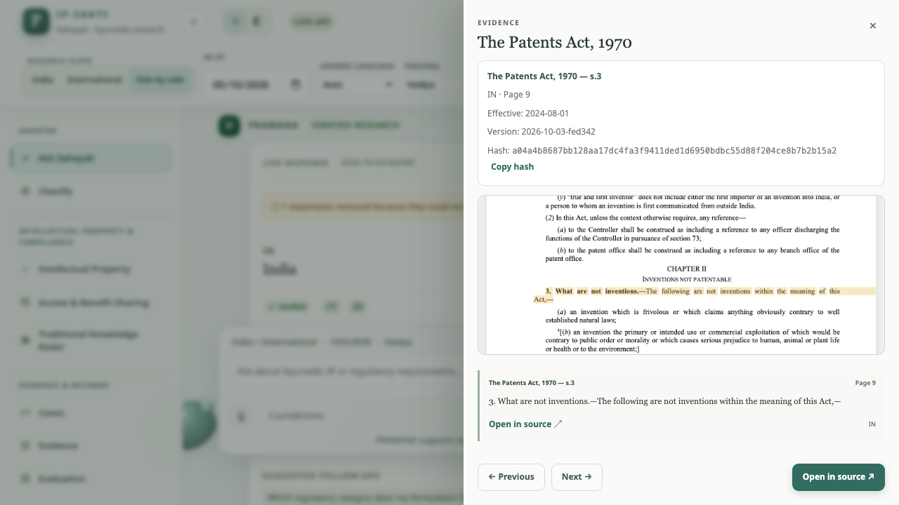
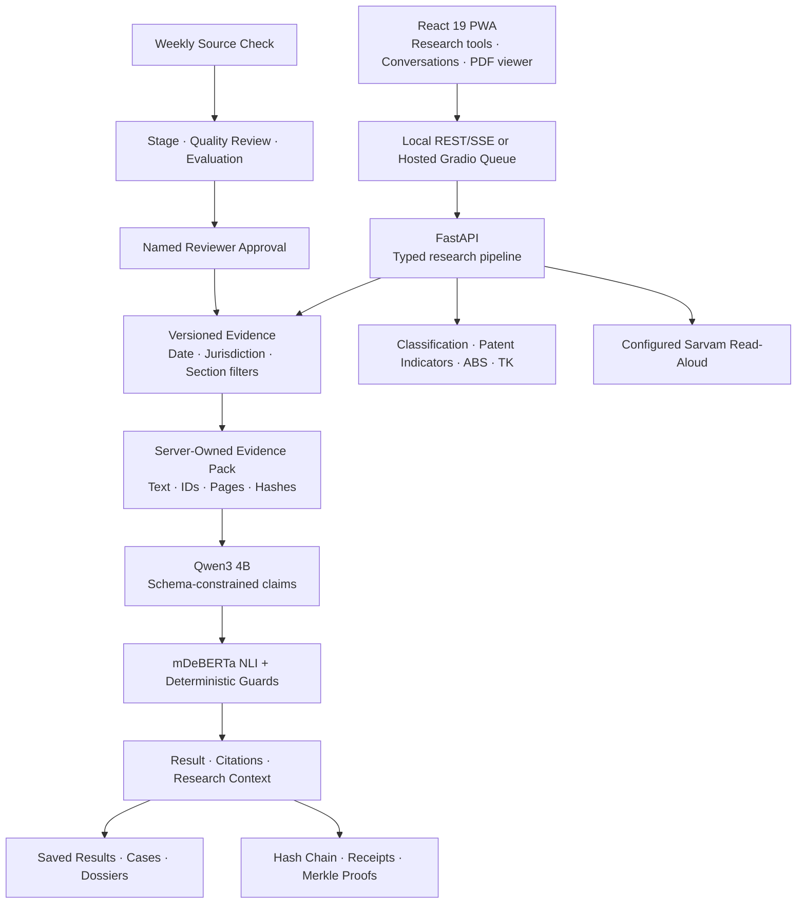
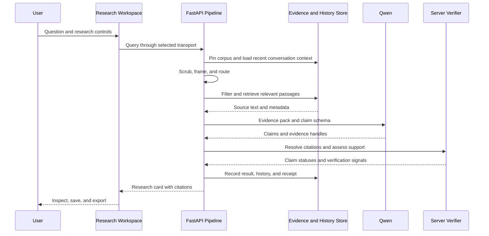
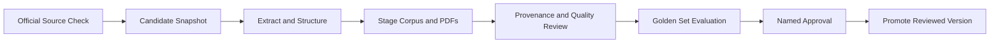

<div align="center">

# 📜 PRAMANA

### **IP-SAKTI Sahayak**

*Evidence-Grounded Intelligence for Ayurveda Intellectual Property and Regulatory Research*

[](PRAMANA_IMPLEMENTATION_PLAN.md)
[](PRAMANA_IMPLEMENTATION_PLAN.md)
[](backend/pyproject.toml)
[](frontend/package.json)
[](backend/app/generation/claim_schema.py)
[](deploy/huggingface/app.py)
[](docker-compose.yml)

**[Open the Prototype](https://huggingface.co/spaces/RJ8307/pramana-sih)** · **[Deployment Guide](docs/HUGGING_FACE_DEPLOYMENT.md)** · **[Testing Guide](docs/USER_TEST_GUIDE.md)**

PRAMANA brings conversational research, formulation analysis, legal evidence, and research dossiers into one workspace. Ask a question in everyday language, inspect the provisions behind the answer, follow an explainable decision path, and collect useful findings into a source-linked case file.

**Ask → Retrieve → Verify → Inspect → Save → Export**

`🔎 Proof-Carrying Answers` · `📄 Highlighted Source PDFs` · `🌐 Multilingual Research` · `🧾 Verifiable Receipts`

</div>

---

<a id="features-offered"></a>
## ✨ Features Offered

| # | Feature | What the prototype delivers |
|---|---------|----------------------------|
| 1 | **Proof-Carrying Answers** | Qwen generates structured claims; the server resolves evidence IDs and checks support before displaying the result. |
| 2 | **As-of Research & Jurisdiction Filtering** | Corpus versions, effective dates, named instruments, and India/international filters establish the research scope. |
| 3 | **Claim Verification** | Natural language inference and checks for numbers, dates, references, negation, and modality assess each claim against its cited material. |
| 4 | **Section-Aware Retrieval** | Citation parsing, ranked text search, model-compatible retrieval, and legal-context expansion connect questions with indexed provisions. |
| 5 | **Adaptive Product Classification** | Up to four fact groups guide users through six provisional product research pathways. |
| 6 | **Intellectual Property Research** | Source-linked patent rule indicators show the declared facts, triggered rules, and decision path. |
| 7 | **Access & Benefit Sharing** | Activity-based checklists organize relevant statutory provisions for applicability review. |
| 8 | **Traditional Knowledge Radar** | Botanical name normalization, classical seed-formulation matching, watchlist context, and a copyable TKDL query pack support preliminary research. |
| 9 | **Conversations & Case Files** | Resume shared research, organize saved results, and generate PDF, DOCX, or Markdown dossiers. |
| 10 | **Evidence & Audit** | Open cited PDF pages, inspect highlights, and verify receipt chains and corpus membership proofs. |
| 11 | **Multilingual Text & Read-Aloud** | Eleven answer-language options, five interface translations, glossary-aware translation, and configurable Sarvam speech. |
| 12 | **Mobile-Optimized PWA** | Responsive navigation, cached application assets, and a bundled PDF worker provide one interface across desktop and mobile. |

---

<a id="who-its-for"></a>
## 👥 Who It's For

| User | Research objective | Useful tools |
|------|--------------------|--------------|
| **Vaidya / practitioner** | Understand source-linked formulation and regulatory information | Ask Sahayak, Traditional Knowledge Radar, read-aloud |
| **Ayush startup founder** | Investigate a product pathway and related research questions | Classify, Intellectual Property, ABS, Cases |
| **Researcher** | Examine provisions and traditional-knowledge relationships | Evidence, citations, botanical normalization, receipts |
| **Patent professional** | Review the material behind a patent-rule indicator | Intellectual Property, source viewer, decision paths |
| **Institutional reviewer** | Trace findings to their source and processing context | Receipts, corpus versions, Evaluation, dossiers |
| **Student** | Explore indexed legal material through clear explanations | Ask Sahayak, language controls, source excerpts |

PRAMANA organizes evidence and research questions for informed discussion and professional review.

---

<a id="table-of-contents"></a>
## 📖 Table of Contents

- [Features Offered](#features-offered)
- [Who It's For](#who-its-for)
- [UI Preview](#ui-preview)
- [Design Law](#design-law)
- [System Architecture](#system-architecture)
- [Query Lifecycle](#query-lifecycle)
- [Retrieval Design](#retrieval-design)
- [Proof-Carrying Generation & Claim Firewall](#proof-carrying-generation--claim-firewall)
- [Risk-Controlled Abstention](#risk-controlled-abstention)
- [Deterministic Decision Engines](#deterministic-decision-engines)
- [Traditional Knowledge, Botanicals & Prior Art](#traditional-knowledge-botanicals--prior-art)
- [Multilingual & Voice](#multilingual--voice)
- [Corpus & Ingestion](#corpus--ingestion)
- [Data Model](#data-model)
- [Security & Privacy](#security--privacy)
- [Audit & Verify Receipt](#audit--verify-receipt)
- [Evaluation Harness](#evaluation-harness)
- [Prototype Capabilities](#prototype-capabilities)
- [API Surface](#api-surface)
- [Quick Start](#quick-start)
- [Repo Layout](#repo-layout)
- [Tech Stack](#tech-stack)
- [Demo Script](#demo-script)
- [Research Workflow](#research-workflow)

---

<a id="ui-preview"></a>
## 🖥️ UI Preview

<div align="center">



*Recorded hosted-browser verification: an answer's citation opens the source PDF and highlighted passage.*

</div>

| Tab | Purpose |
|-----|---------|
| **Ask Sahayak** | Ask questions, inspect claim support, continue conversations, and select findings for a case file. |
| **Classify** | Gather product facts and explore a provisional regulatory pathway. |
| **Intellectual Property** | Examine patent rule indicators and source-linked reasoning. |
| **Access & Benefit Sharing** | Build a statutory research checklist from the selected activities. |
| **Traditional Knowledge Radar** | Normalize ingredients, inspect classical seed matches, and prepare a TKDL query pack. |
| **Cases** | Organize selected results and export a research dossier. |
| **Evidence** | Browse indexed documents, official-source links, effective dates, and corpus versions. |
| **Evaluation** | Inspect recorded routing, retrieval, and system-quality results. |

A receipt view provides audit verification, while the shared source drawer keeps supporting text and PDF pages close to the finding being reviewed.

---

<a id="design-law"></a>
## 📜 Design Law

**Every substantive explanation should remain connected to inspectable evidence.**

```text
PIN → SCRUB → FRAME → ROUTE → RETRIEVE → RESOLVE → GENERATE → VERIFY → RENDER → AUDIT
```

The architecture gives each component a clear responsibility:

- **The source collection owns the evidence:** excerpts come from stored, versioned text.
- **The model drafts the explanation:** claims identify supporting evidence handles.
- **The server computes claim status:** citation resolution, support checks, and deterministic guards control the result.
- **The research scope controls retrieval:** date, jurisdiction, corpus version, and named instruments filter candidates.
- **The audit layer records provenance:** receipts connect results to their evidence and processing context.
- **The ingestion workflow governs updates:** reviewed candidates receive named approval before promotion.

These boundaries make the relationship between a generated explanation and its supporting material visible throughout the application.

---

<a id="system-architecture"></a>
## 🏗️ System Architecture

PRAMANA has two execution profiles that share the research interface, claim schema, citation checks, decision tools, and audit workflow.

| Profile | Inference | Storage | Request transport |
|---------|-----------|---------|-------------------|
| **Hosted judging prototype** | Qwen models in PyTorch on Hugging Face ZeroGPU | Session SQLite with FTS5/BM25 and a checksum-verified corpus seed | Gradio queue for generation; FastAPI research routes |
| **Local Mac workspace** | Native Ollama with Qwen models; local NLI verification | PostgreSQL 16, pgvector, text search, history, and receipts | REST and server-sent events through the Nginx proxy |



### Layer Decisions

| Layer | Choice | Purpose |
|-------|--------|---------|
| **Interface** | React, TypeScript, Vite, PWA assets | A single responsive research workspace |
| **Orchestration** | Typed asynchronous generator | Explicit stages, shared request state, and timing information |
| **API contracts** | FastAPI, Pydantic, generated OpenAPI and TypeScript | Consistent request and response shapes |
| **Generation** | Qwen3 4B, temperature zero / greedy decoding, thinking disabled, context capped at 8K | Controlled structured explanations |
| **Embedding operations** | Qwen3 Embedding 0.6B, 1,024 dimensions | Multilingual embedding and model-aware retrieval operations |
| **Verification** | mDeBERTa NLI and deterministic guards | Claim-level support assessment |
| **Source inspection** | Versioned PDFs and bundled PDF.js worker | Cited-page rendering and highlights |
| **Audit** | Hash chain and corpus Merkle proofs | Inspectable record integrity and evidence membership |

---

<a id="query-lifecycle"></a>
## 🔄 Query Lifecycle



Stage events show progress while the request is processed. Recent saved turns help interpret follow-up questions, and each answer retrieves its own source material. Verification completes before the final research card is displayed.

---

<a id="retrieval-design"></a>
## 🔎 Retrieval Design

**Filter first, retrieve by relevance, preserve legal context.**

1. **Scope the evidence:** apply corpus version, jurisdiction, effective-date, and named-instrument constraints.
2. **Recognize citations:** use document and section references to locate eligible provisions.
3. **Rank stored text:** PostgreSQL text search and trigram support serve the local profile; SQLite FTS5/BM25 serves the hosted prototype.
4. **Respect model identity:** dense retrieval uses corpus vectors compatible with the configured embedding model.
5. **Combine compatible rankings:** reciprocal rank fusion organizes results within jurisdiction buckets.
6. **Expand legal context:** section parents and relevant relationships preserve surrounding conditions.
7. **Build a bounded pack:** complete source blocks fit within the generation budget.

The deployed source snapshot uses ranked keyword retrieval. Corpus metadata controls embedding compatibility, keeping retrieval tied to the correct source and model identities.

---

<a id="proof-carrying-generation--claim-firewall"></a>
## ✅ Proof-Carrying Generation & Claim Firewall

PRAMANA separates **what the model writes** from **what the source says** and **what the server verifies**.

| Step | Responsibility |
|------|----------------|
| **Evidence pack** | Store-owned text with numbered handles, source metadata, page locations, and hashes |
| **Structured generation** | Claims and supporting evidence handles in the project's JSON Schema |
| **Contract validation** | Pydantic validates the model output |
| **Citation resolution** | The server maps handles to known evidence IDs |
| **Support assessment** | NLI compares each claim with its cited passages |
| **Deterministic checks** | Numbers, dates, section references, negation, and modality are assessed |
| **Research card** | Supported claims, original excerpts, citation controls, and a receipt |

Ollama supplies JSON Schema output in the local profile. The hosted adapter uses schema-constrained tokens and final Pydantic validation. Claim statuses are computed by the server from the cited material.

---

<a id="risk-controlled-abstention"></a>
## 🎚️ Risk-Controlled Abstention

**Evidence-aware responses** keep the research interaction grounded in its selected sources.

The pipeline combines retrieval margin, mean entailment, verified-claim ratio, and translation checks into confidence signals. Response handling distinguishes research scope, evidence availability, model availability, and support level. Retrieved excerpts can be presented directly when appropriate, preserving access to the original material.

Review recommendations, clarification prompts, and request-linked review tickets help users decide what to inspect next. Confidence labels accompany the evidence and processing context of the result.

---

<a id="deterministic-decision-engines"></a>
## 🧮 Deterministic Decision Engines

### Adaptive Product Classification

The wizard gathers up to four distinct groups of facts:

1. **Intended use and claims** — therapeutic purpose and proposed label claims.
2. **Administration and form** — route, dosage, product form, and intended population.
3. **Classical source relationship** — identified source passages and declared deviations.
4. **Ingredients and preparation** — ingredient basis, extraction, novelty, and marker details.

| Provisional pathway | Research focus |
|---------------------|----------------|
| **Classical / generic** | Declared classical match and medicinal facts |
| **Patent or proprietary** | Formulation deviations and medicinal research pathway |
| **New / investigational** | Novelty, ingredient, route, or extract research |
| **Phytopharmaceutical** | Purified-fraction and marker-related facts |
| **Aahara / nutraceutical** | Food-related research pathway |
| **Cosmetic** | External cosmetic-use research pathway |

Adaptive prompts collect clarification where needed, and source-linked outcomes expose the facts and decision path used.

### Intellectual Property Indicators

The patent research tool applies a versioned rule set to declared formulation facts. Indicators associated with **3(p), 3(e), and 3(d)** display triggered rules, reasons, and supporting provisions. The gauge summarizes rule weights, while the decision path makes the underlying research questions inspectable.

### Access and Benefit Sharing

Selected activities guide a **source-backed statutory checklist**. Research, commercial utilization, intellectual property, transfers, export, and cultivation or trade lead to relevant provision groups for applicability review.

---

<a id="traditional-knowledge-botanicals--prior-art"></a>
## 🌿 Traditional Knowledge, Botanicals & Prior Art

The Traditional Knowledge Radar connects ingredient identity with preliminary formulation research.

- **Botanical ontology:** recognized common, Sanskrit, regional, and Latin names map to structured plant records.
- **Classical seed matching:** ingredient-set overlap against a curated ten-formulation dataset, with an indication-match signal.
- **Explainable comparisons:** shared, missing, and additional ingredients appear beside the match.
- **Radar visualization:** matching signals are presented in an interactive chart.
- **Watchlist context:** seeded case summaries provide research leads and source links.
- **TKDL query builder:** copyable search terms and candidate classification material support later authorized searching.

Formulation tools connect this ingredient research with classification, patent indicators, and saved findings in the wider workspace.

---

<a id="multilingual--voice"></a>
## 🌐 Multilingual & Voice

**Typed research in eleven languages, with configurable Sarvam read-aloud.**

| Layer | Implementation |
|-------|----------------|
| **Answer languages** | English, Hindi, Tamil, Bengali, Marathi, Telugu, Gujarati, Kannada, Malayalam, Punjabi, and Odia |
| **Interface languages** | English, Hindi, Tamil, Bengali, and Marathi |
| **Research pivot** | Qwen translation into English for retrieval and claim verification |
| **Terminology** | Glossary masking and restoration for selected terms |
| **Evidence text** | Original excerpts retain their stored wording |
| **Output check** | Back translation with a token-overlap fidelity check |
| **Read-aloud** | Sarvam Bulbul v3 through the backend's configured API key |
| **Playback** | Sequential chunks, stop/cancel controls, and validated WAV audio |

```text
Typed question → language detection → English research pivot
    → retrieve evidence → generate and verify claims
    → requested-language explanation → explicit Sarvam read-aloud
```

Read-aloud requests are initiated through the Listen control. The backend holds the credential and returns audio to the interface. Long answers are divided into requests of at most 2,500 characters, preserving sequential playback.

---

<a id="corpus--ingestion"></a>
## 📚 Corpus & Ingestion

### Versioned Source Collection

The hosted export includes **28 documents**, **3,664 sections/chunks**, and **223 legal relationships** from the live source snapshot. The [source manifest](corpus/manifest.yaml) pins provenance and hashes; the [coverage matrix](corpus/coverage.yaml) organizes 22 research topics.

| Research area | Source organization |
|---------------|---------------------|
| **Indian intellectual property** | Patent, trade mark, geographical indication, design, copyright, and plant-variety topics |
| **Ayurveda regulation** | Drugs/cosmetics, clinical research, Ayurveda Aahara, advertising, and label topics |
| **Biodiversity and ABS** | Biological diversity legislation, rules, and regulatory material |
| **International research** | Treaty and international-framework topics |

The Evidence tab connects indexed documents with official-source links, effective dates, and collection versions.

### Reviewed Ingestion Workflow



The weekly source checker prepares separate candidates. Promotion binds reviewer approval to the exact quality report and reviewed source contents.

```sh
make check-sources
make stage-source-update MANIFEST=/workspace/corpus/raw/source-updates/<timestamp>/manifest.yaml
make ingest
make review-stage V=<staged-version>
make approve-stage V=<staged-version> REVIEWER='<reviewer-name>' REPORT_HASH=<reviewed-report-hash>
make promote V=<staged-version>
```

Use the generated candidate path, staged version, and actual reviewer-approved report in these commands. The [canonical plan](PRAMANA_IMPLEMENTATION_PLAN.md) defines the review and promotion requirements.

---

<a id="data-model"></a>
## 🗄️ Data Model

The same research concepts are represented in local PostgreSQL and the hosted session SQLite profile.

| Records | Purpose |
|---------|---------|
| **Corpus and document versions** | Source identity, provenance, artifact hashes, and effective dates |
| **Sections, chunks, and edges** | Structured legal text, locators, retrieval metadata, and relationships |
| **Source reviews** | Quality reports and exact reviewer approval |
| **Requests and saved results** | Research context, result payloads, and receipt references |
| **Conversations and messages** | Scrubbed research turns and bounded follow-up context |
| **Case references** | Selected results and dossier ordering |
| **Audit entries and receipts** | Chain links, evidence proofs, and processing provenance |
| **Evaluation runs** | Recorded conditions and measured outputs |

The local workspace applies thirty-day saved-content expiry. The hosted profile uses a session workspace initialized from the corpus seed. Dossier downloads let users retain selected research on their own device.

---

<a id="security--privacy"></a>
## 🔒 Security & Privacy

**Evidence provenance and deliberate data handling are built into the workflow.**

- **Identifier scrubbing:** recognizable email, phone, Aadhaar, PAN, and GSTIN patterns are scrubbed before content is saved.
- **Backend credentials:** database and speech secrets remain in server configuration.
- **Workspace access:** local history uses the configured demo key; the public judging interface opens the shared research workspace.
- **Scoped database roles:** runtime, ingestion, and owner connections separate their responsibilities in the local profile.
- **Versioned artifacts:** source metadata and hashes identify the PDF associated with an evidence span.
- **Controlled promotion:** source updates pass through reviewed staging and named approval.
- **Separate audit data:** provenance records are maintained separately from expiring saved-result content.

Shared conversations and case files support collaboration within the demo workspace. The [implementation plan](PRAMANA_IMPLEMENTATION_PLAN.md) documents the storage and access model.

---

<a id="audit--verify-receipt"></a>
## 🧾 Audit & Verify Receipt

**A research result can be traced back to its recorded evidence.**

Receipts identify the request, corpus version, creation time, query hash, prompt version, model information, and audit-chain link. The **Verify Receipt** action recomputes integrity checks through the backend.

| Mechanism | What it checks |
|-----------|----------------|
| **Hash-chained ledger** | Consistency of the recorded audit sequence and payload hashes |
| **Merkle proof** | Membership of a cited chunk in the recorded corpus root |
| **Version-pinned artifact** | Identity of the PDF associated with the selected source version |

The hosted verification exercised an actual generated answer, its receipt chain, and both cited-evidence membership proofs.

---

<a id="evaluation-harness"></a>
## 📏 Evaluation Harness

**Recorded verification on 5 October 2026** connects software checks with a real hosted research workflow.

| Check | Recorded result |
|-------|-----------------|
| **Backend unit and contract tests** | 282 passed |
| **PostgreSQL invariant tests** | 16 passed |
| **Frontend unit tests** | 41 passed |
| **Backend checks** | Ruff and mypy passed |
| **Frontend checks** | Lint, TypeScript, and production build passed |
| **Hosted browser workflow** | Queued generation, reload/resume, PDF worker, cited highlight, and fixed sidebar passed |
| **Actual hosted synthesis** | One verified claim, two citations, and a receipt for the tested section 3(p) question |
| **Receipt verification** | Audit chain and both Merkle proofs passed |
| **Dossier workflow** | Saved-result lookup, case reference, PDF export, and DOCX export checked |
| **Sampled local memory** | 8.52 GB observed against the 12 GB target in the recorded workload |

The tested hosted question completed its request pipeline in **10,216 ms**. The [verification report](docs/VERIFICATION_REPORT.md) records the test conditions, methods, and results.

### Run the Checks

```sh
# Backend checks through the local Compose environment.
make test
make lint
make typecheck

# Frontend checks.
npm --prefix frontend ci
npm --prefix frontend test
npm --prefix frontend run lint
npm --prefix frontend run build
(cd frontend && npx playwright install chromium)
npm --prefix frontend run test:e2e

# Recorded routing and retrieval evaluation.
docker compose exec -T backend python -m app.routing_eval
make eval
```

### Connected Acceptance

```sh
make install PYTHON=python3.12
curl --fail http://localhost:8080/v1/health
.venv/bin/python scripts/check_live.py
.venv/bin/python scripts/run-browser-tests.py
.venv/bin/python scripts/check_memory.py --seconds 75
```

The [user testing guide](docs/USER_TEST_GUIDE.md) and [solution and testing document](docs/PRAMANA_SOLUTION_AND_TESTING_GUIDE.docx) describe the connected workflows in detail. Maintenance tests temporarily stop the local API and restore it afterward.

---

<a id="prototype-capabilities"></a>
## 🚦 Prototype Capabilities

| Layer | Connected capabilities |
|-------|------------------------|
| **Research core** | Source retrieval, structured generation, claim verification, date/jurisdiction filtering, and citations |
| **Decision tools** | Adaptive classification, patent research indicators, ABS checklists, and traditional knowledge matching |
| **Research continuity** | Conversations, saved results, case references, and dossier exports |
| **Evidence inspection** | Source library, PDF highlights, receipts, and membership verification |
| **Source governance** | Coverage records, weekly change checking, staged review, evaluation, and approval-controlled promotion |
| **Delivery** | Production PWA, local Compose workspace, and hosted ZeroGPU execution |

These layers share the project's typed interfaces and evidence records, allowing a user to move from a question to a source-linked dossier through one connected application.

---

<a id="api-surface"></a>
## 🔌 API Surface

Research routes use the `/v1` prefix. The hosted profile queues generation through Gradio, while the local profile streams query stages through SSE.

| Method | Endpoint | Purpose |
|--------|----------|---------|
| `GET` | `/v1/health` | Runtime, model, and corpus readiness |
| `POST` | `/v1/query` | Local query stage/result stream |
| `POST / GET` | `/v1/conversations` | Create and list conversations |
| `GET / DELETE` | `/v1/conversations/{id}` | Resume or delete a conversation |
| `GET` | `/v1/requests/{request_id}` | Retrieve a saved result |
| `GET / PUT` | `/v1/case-file` | Read or reorder case references |
| `POST / DELETE` | `/v1/case-file/{request_id}` | Add or remove a selected result |
| `POST` | `/v1/classify` | Adaptive prompt or provisional product pathway |
| `POST` | `/v1/patent-risk` | Source-linked patent indicators |
| `POST` | `/v1/abs-check` | Statutory research checklist |
| `POST` | `/v1/tk-radar` | Name normalization, seed matches, and query pack |
| `POST` | `/v1/dossier` | Export saved results |
| `GET` | `/v1/documents` | Source document library |
| `GET` | `/v1/documents/{doc_id}/pdf` | Version-pinned PDF |
| `GET` | `/v1/spans/{evidence_id}` | Resolve evidence |
| `GET` | `/v1/corpus/versions` | Corpus version records |
| `GET` | `/v1/corpus/coverage` | Topic coverage records |
| `GET` | `/v1/receipts/{receipt_id}` | Receipt details |
| `POST` | `/v1/receipts/{receipt_id}/verify` | Chain and membership checks |
| `POST` | `/v1/speech/tts` | Configured Sarvam WAV read-aloud |
| `POST / GET` | `/v1/escalations` | Create a review ticket or access the admin listing |
| `GET` | `/v1/eval/latest` | Recorded evaluation output |

Backend schemas generate [OpenAPI](contracts/openapi.yaml) and [frontend types](frontend/src/api/types.gen.ts). Local interactive API documentation is available at `http://localhost:8000/docs`.

```sh
make contracts
npm --prefix frontend run types:generate
```

---

<a id="quick-start"></a>
## 🚀 Quick Start

### Hosted Prototype

Open **[PRAMANA on Hugging Face](https://huggingface.co/spaces/RJ8307/pramana-sih)**. The Space runs the production website, Qwen inference, citation verification, and session research storage on hosted infrastructure.

The [ZeroGPU deployment guide](docs/HUGGING_FACE_DEPLOYMENT.md) explains how to build the actual corpus seed and application upload bundle.

### Local Mac Workspace

Use a 16 GB MacBook, Docker Desktop with Compose, and native Ollama. Python 3.12 and Node/npm support the optional host development and testing workflow.

From the project root:

```sh
# Preserve an existing environment file.
test -f .env || cp .env.example .env

# Install the selected native models.
ollama pull qwen3:4b
ollama pull qwen3-embedding:0.6b
```

Set distinct random `POSTGRES_PASSWORD`, `APP_DB_PASSWORD`, `INGEST_DB_PASSWORD`, and `DEMO_KEY` values in `.env`. Match the host database URLs to those credentials. Compose provides the container connection addresses.

```dotenv
LLM_MODEL=qwen3:4b
EMBED_MODEL=qwen3-embedding:0.6b
OLLAMA_CONTEXT_TOKENS=8192
OLLAMA_KEEP_ALIVE=5m
TRANSLATE_PROVIDER=llm
RERANK=0
MOCK_MODE=0
VITE_API_MODE=live
MEMORY_BUDGET_GB=12
WORKSPACE_ID=shared-demo
HISTORY_RETENTION_DAYS=30
```

Configure native Ollama concurrency, then restart the Ollama app:

```sh
launchctl setenv OLLAMA_NUM_PARALLEL 1
launchctl setenv OLLAMA_MAX_LOADED_MODELS 2
```

Start the workspace:

```sh
docker compose up --build -d
docker compose ps
curl --fail http://localhost:8080/v1/health
```

Open `http://localhost:8080`. Under Saved conversations, enter the configured demo key to connect the shared local workspace. A new database is populated through the reviewed corpus ingestion workflow described above.

### Configure Sarvam Read-Aloud

Use the existing Sarvam account key in the backend environment or the hosted Space's private Secrets:

```dotenv
SARVAM_API_KEY=<your-sarvam-key>
SARVAM_TTS_MODEL=bulbul:v3
SARVAM_TTS_SPEAKER=shubh
SARVAM_TTS_TIMEOUT_S=60
```

After changing the local `.env`, reload the backend environment:

```sh
docker compose up -d --force-recreate backend
```

### Build a Hosted Bundle

With the local live corpus available:

```sh
make install PYTHON=python3.12
npm --prefix frontend ci

PRAMANA_BUNDLE_TAG="$(date +%Y%m%dT%H%M%S)"
PRAMANA_SEED_DIR="deploy/data/space-seed-${PRAMANA_BUNDLE_TAG}"
PRAMANA_UPLOAD_DIR="deploy/data/space-upload-${PRAMANA_BUNDLE_TAG}"

PYTHONPATH=backend .venv/bin/python scripts/export-space-seed.py \
  --from-compose --output "$PRAMANA_SEED_DIR"

.venv/bin/python scripts/build-space.py \
  --seed "$PRAMANA_SEED_DIR" --output "$PRAMANA_UPLOAD_DIR" \
  --archive-assets
```

The prepared bundle contains the entry point, metadata, dependencies, backend, production frontend, corpus snapshot, and matching source PDFs. Follow the deployment guide to publish that bundle to the Space.

---

<a id="repo-layout"></a>
## 🗂️ Repo Layout

```text
README.md                         Project overview and setup
PRAMANA_IMPLEMENTATION_PLAN.md     Canonical requirements and acceptance
Dockerfile                        Hosted Docker profile
docker-compose.yml                Local Mac services
Makefile                          Development and maintenance commands
backend/
  app/api/                        Research interfaces
  app/orchestrator/               Typed query pipeline and routing
  app/retrieval/                   Search and evidence packs
  app/generation/                 Ollama and hosted Qwen adapters
  app/verification/               NLI, guards, and confidence
  app/ingest/                      Extraction, review, monitoring, and promotion
  app/history/                    Conversations, results, and expiry
  app/audit/                      Receipts, chain, and Merkle proofs
  app/rules/                      Classification, patent, and ABS logic
  app/tk/                         Botanical data, matching, and query builder
  app/render/                     Dossier exports
  alembic/versions/                Database migrations
  tests/                          Unit, contract, and invariant tests
frontend/
  src/                            React interface, state, and API clients
  e2e/                            Production browser workflows
contracts/                        Generated API contract and test fixtures
corpus/                           Source manifest and coverage metadata
deploy/huggingface/                ZeroGPU entry point and dependencies
eval/                             Golden sets and evaluation harness
scripts/                          Acceptance and deployment builders
docs/                             Deployment, testing, and verification records
```

The root plan is canonical; `docs/IMPLEMENTATION_PLAN.md` points to it.

---

<a id="tech-stack"></a>
## 📚 Tech Stack

| Concern | Technology |
|---------|------------|
| **Frontend** | React 19, TypeScript, Vite, React Router, TanStack Query, Zustand |
| **Presentation** | CSS/Tailwind tooling, React Flow, Dagre, Recharts |
| **Multilingual UI** | i18next and language-specific font assets |
| **Source viewer** | PDF.js with bundled worker |
| **API** | FastAPI, Pydantic, Uvicorn |
| **Orchestration** | Typed asynchronous generator |
| **Local inference** | Native Ollama, Qwen3 4B, Qwen3 Embedding 0.6B |
| **Hosted inference** | PyTorch, Transformers, schema token constraints, Gradio, Hugging Face ZeroGPU |
| **Verification** | mDeBERTa NLI and deterministic guards |
| **Local storage** | PostgreSQL 16, pgvector, full-text search, pg_trgm, SQLAlchemy, Alembic |
| **Hosted storage** | SQLite, FTS5/BM25, checked corpus seed |
| **Read-aloud** | Configurable Sarvam Bulbul v3 |
| **Extraction** | PyMuPDF and legal-section parsing |
| **Exports** | Markdown, python-docx, ReportLab |
| **Quality tooling** | pytest, Ruff, mypy, Vitest, Testing Library, Playwright |
| **Delivery** | Docker Compose, Nginx, PWA assets, ZeroGPU Space |

---

<a id="demo-script"></a>
## 🎬 Demo Script

1. **Open the prototype** and select India, English, and the desired research date.
2. **Ask a cited question:** “What does section 3(p) of the Patents Act say about traditional knowledge?”
3. **Inspect the answer:** review the claim status and supporting evidence IDs.
4. **Open a citation:** inspect the source passage, PDF page, and highlight.
5. **Verify the receipt:** run the chain and corpus-membership checks.
6. **Continue the conversation:** ask a follow-up, then reload and resume the saved research.
7. **Classify a product:** provide purpose, claims, administration, classical relationship, and ingredient details.
8. **Explore related tools:** examine patent indicators, the ABS checklist, and classical seed matches.
9. **Build a case file:** select an actual saved answer, organize the results, and export a dossier.
10. **Inspect the research collection:** open Evidence and Evaluation to review sources and recorded measurements.
11. **Use configured read-aloud:** press Listen to play a displayed answer through Sarvam.

---

<a id="research-workflow"></a>
## 🌱 Research Workflow

**Start with the question. Follow the evidence. Keep the findings.**

Use Classify to organize product facts, Ask Sahayak to explore indexed provisions, and the Intellectual Property, ABS, and Traditional Knowledge tools to investigate related research questions. Open citations as you review each finding, then collect the useful results in Cases.

A dossier brings selected answers, source text, and receipt references together for discussion, documentation, and further review. The source library and audit tools keep the research connected to the material behind it.

---

<div align="center">

**[Explore PRAMANA](https://huggingface.co/spaces/RJ8307/pramana-sih)**

*PRAMANA · IP-SAKTI Sahayak · SIH 2026 / PS SIH26045*

</div>
